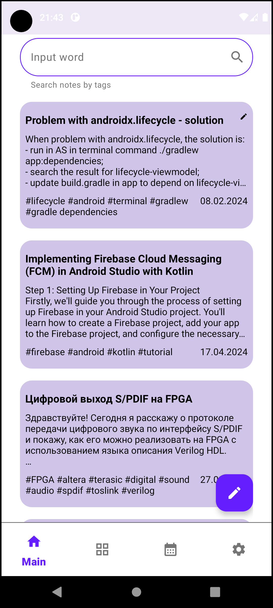

# Diary notes

Android OS application.

There are sometimes moments in any person's life when it is necessary to solve a problem
that you have already encountered in the past. It happens that it is necessary to remember what actions were performed
in order to repair something,
eliminate a specific bug of the program, issue documents and so on. It is not always
possible to remember such things or find
a solution to them on the Internet. It is even important for someone to remember
their feelings and experiences that arose in connection with this in the past or just keep their own personal diary.
In such cases, you can use the DiaryNote application.

The application has a simple and user-friendly interface for creating and searching notes. No matter how many notes
you have, you can always easily find the desired note by keywords, by date of creation or
by category.

Since user notes may contain a lot of personal information, it is important to keep it safe and in security. 
The user can configure the application to log in only with a password, create several
accounts. Encrypting the application's data ensures that no one can read the user's notes.

If you decide to transfer notes to another phone, you can use
the data saving/recovery function. For security purpose, the file with the transferred data can be encrypted.

## Incentive

The motivation for creating this application is to study the basic technologies used in
Android OS app development. The functionality and ergonomics of the application are based on the wishes
of the developer himself.

## Technologies

+ Jetpack Navigation

  Version: 2.6.0-alpha04

+ RxJava3
  
  Version: 3.1.5

+ Room

  Version: 2.4.3

+ SQLCipher

  Version: 4.5.3

+ Paging 3

  Version: 3.2.1

+ Koin

  Version: 3.2.0

+ Coil

  Version: 2.5.0

## Installation

Clone this repository and import into Android Studio

```bash
git clone https://github.com/profitsw2000/DiaryNote.git
```

## Illustration





## Features

+ create, edit and delete notes
+ search for notes by keywords
+ search settings - change the priority of the search(by tags, title, text)
+ sort notes by category
+ create, edit and delete categories
+ view notes by date
+ login to the application by username and password or without it
+ Russian and English language of the application
+ app theming
+ help section in the application
+ database encryption (SQLCipherUtils)
+ backup/restore data
+ add and delete information to user profile

### ToDo:

+ add pictures to notes
+ add new color selector on the notes category creation screen
+ add animations on screens with text (show/hide the appbar when scrolling)
+ animations with a note list item on the main and other screens

## Sources
This application is largely created thanks to information taken from the following sites:
+ [CommonsWare](https://commonsware.com)
+ [STARTANDROID](https://startandroid.ru)
+ [Material Design](https://m3.material.io)
+ [AndroidDevelopers](https://developer.android.com)

## App status

+ 19.04.2024 - v1.0

## About

Developed by profitsw2000.

email: profitsw2000@gmail.com

